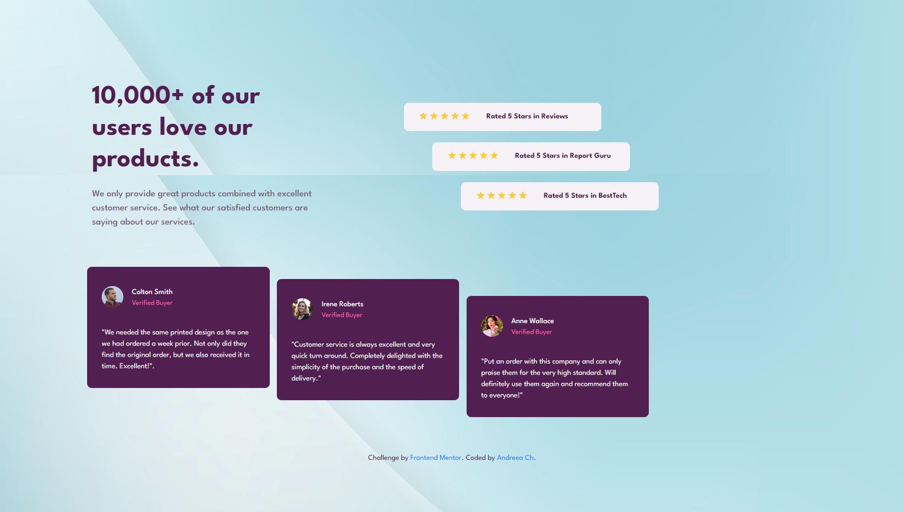
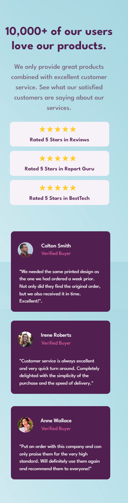

# Frontend Mentor - Social proof section solution

This is a solution to the [Social proof section challenge on Frontend Mentor](https://www.frontendmentor.io/challenges/social-proof-section-6e0qTv_bA). Frontend Mentor challenges help you improve your coding skills by building realistic projects. 

## Table of contents

- [Overview](#overview)
  - [The challenge](#the-challenge)
  - [Screenshot](#screenshot)
  - [Links](#links)
- [My process](#my-process)
  - [Built with](#built-with)
  - [Other tools used](#other-tools-used)
  - [What I learned](#what-i-learned)
  - [Useful resources](#useful-resources)


## Overview

### The challenge

Users should be able to:

- View the optimal layout for the section depending on their device's screen size

### Screenshot





### Links

- Solution URL: [https://github.com/andr-ch/Social-proof-section.git](https://github.com/andr-ch/Social-proof-section.git)
- Live Site URL: [https://andr-ch.github.io/Social-proof-section/](https://andr-ch.github.io/Social-proof-section/)


## My process

### Built with

- Semantic HTML5 Markup: Used to structure the content in a meaningful and accessible way.
- Bootstrap 4.6.2: Leveraged for responsive design and pre-built components to ensure a consistent and professional layout.
- CSS Custom Properties: Employed variables to maintain design consistency and facilitate easier updates and theming.
- Flexbox: Utilized for flexible, efficient layout structures that adapt seamlessly across various screen sizes.
- Mobile-First Workflow: Designed the interface with mobile users as the primary focus, then enhanced for larger screens.
- Google Fonts: Incorporated custom fonts (League Spartan) from Google Fonts to enhance typography and maintain a unique design aesthetic.


### What I learned

1. **Using the "span" Element to Display Star Ratings:**
```html
    <span class="stars">★★★★★</span>
```
	  Here I learned:

- `span` : to display star ratings, allowing for easy styling and inline display within the content.


2. **Ensuring Consistent Styling Across Different Browsers:**
 ```css
* {
    margin: 0;
    padding: 0;
    box-sizing: border-box;
}
```
	  Here I learned:
- universal selector `*`: to enforce consistent styling across all elements. ensuring a consistent starting point across different browsers
- `padding: 0;`: eliminate unexpected spacing within elements
- `box-sizing: border-box;`: to simplify element size calculations by including padding and borders in the total width and height


3. **Overlaying Profile Images with Absolute Positioning:**
 ```css
profile-pic {
    border: 5px solid #fff;
    border-radius: 50%;
    width: 100px;
    height: 100px;
    position: absolute;
    top: 24%;
    left: 50%;
    transform: translateX(-50%);
}
```
	 Here I learned:
- `position: absolute` and `transform: translateX(-50%);` to center profile images over other content


4. **Adjusting Letter Spacing for Star Ratings::**
 ```css
.stars {
  ...
  letter-spacing: 0.1em;
}
```
	 Here I learned:
- `letter-spacing`: to add spacing between the star characters, improving readability


5. **Removing Default Margins:**
 ```css
.star-rating p {
   ...
   margin: 0;
}
```
	 Here I learned:
- `margin: 0;`: on paragraph elements to remove default margins, ensuring precise text alignment within the container


6. **Using Flexbox for a Flexible and Responsive Design:**
 ```css
.star-rating p {
    ...
    flex: 1;
}
```
	 Here I learned:
- `flex: 1;`: applied to paragraphs to allow them to occupy available space in the flex container, ensuring a responsive design


7. **Aligning Items to the Start Using Flexbox Properties:**
 ```css
.star-rating-item {
    ...
    display: flex;
    align-items: center;
    justify-content: flex-start;
    ...
}
```
	 Here I learned:
- using `display: flex;` with `align-items: center;` `justify-content: flex-start;`: to align content items to the start


### Useful resources

- [Bootstrap Documentation ](https://getbootstrap.com/docs/4.6/getting-started/introduction/) - This helped me understand how to use Bootstrap's grid system and utility classes effectively. It was particularly useful for organizing content and ensuring responsiveness across different screen sizes.

- [Google Fonts](https://fonts.google.com/) - This resource was invaluable for integrating custom fonts into my project. I used the Inter and Lexend Deca fonts, which greatly enhanced the visual appeal of my webpage.

- [CSS Tricks ](https://css-tricks.com/snippets/css/a-guide-to-flexbox/) - This article on Flexbox helped me understand how to align and distribute space among items in a container, which was essential for styling my stats section and ensuring it looked good on all devices.

- [MDN Web Docs on CSS Media Queries](https://developer.mozilla.org/en-US/docs/Web/CSS/CSS_media_queries/Using_media_queries) - This resource was crucial for learning how to apply different styles based on screen size. It allowed me to create a responsive design that adapts to various screen resolutions.

- [CSSmatic - Border Radius Generator ](https://www.cssmatic.com/border-radius) - Helpful for experimenting and generating CSS styles such as border radius, box shadow, and more.
